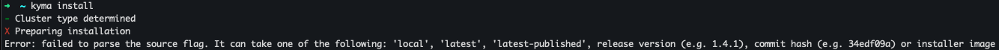
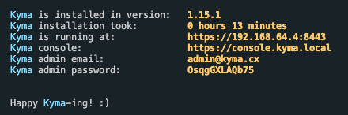
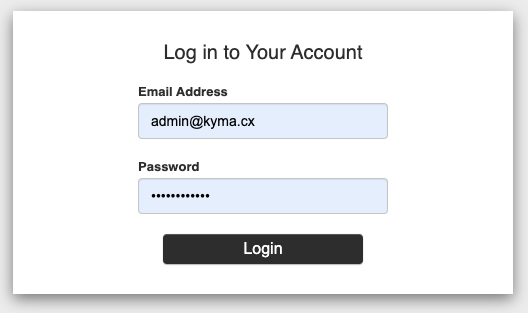

# Kyma

The following steps are MacOS specific.

## Prerequisites

1. Xcode Command Line Tools

2. Brew

## Installation

1. Install Kyma CLI

   `brew install kyma-cli`

2. Install Docker

   Download `Docker.dmg` from <https://www.docker.com/get-started>

3. Install Minikube

   `brew install minikube`

4. Provision a Kubernetes cluster on Minikube

   `kyma provision minikube`

5. Install the latest Kyma release on Minikube

   `kyma install`

   > **NOTE 1:** You might run into the following error when running the previous command.
   > 
   > If you do simply run `kyma install --source <kyma-version>`

   > **NOTE 2:** After installing remember to save your credentials for `Dex`.
   >
   > 
   >
   > The admin email is always the same, if for some reason you lost your password you can get it by running this command `kubectl get secret admin-user -n kyma-system -o jsonpath="{.data.password}" | base64 --decode`

## Running Kyma

1. Open the Console UI.

   `kyma console`

   > **NOTE 1:** After you restart or shutdown your computer you must run `kyma provision minikube` and then `kyma install`.

   > **NOTE 2:** To work with Kyma, use only the provided commands. Kyma requires a specific Minikube configuration and **does not work** on a basic Minikube cluster that you can start using the `minikube start` command.

   > **NOTE 3:** Mozilla Firefox uses its own certificate keychain. If you want to access the Console UI though Firefox, add the Kyma wildcard certificate to the certificate keychain of the browser. For ease of use Chrome is recommended.

2. Login to Dex.

   

## Working with Kyma

1. [Creating functions in Kyma](functions.md)

2. [Connecting to SAP Commerce](connect-sap-to-kyma.md)

3. [Adding the AWS Service Broker](aws-service-broker.md)
