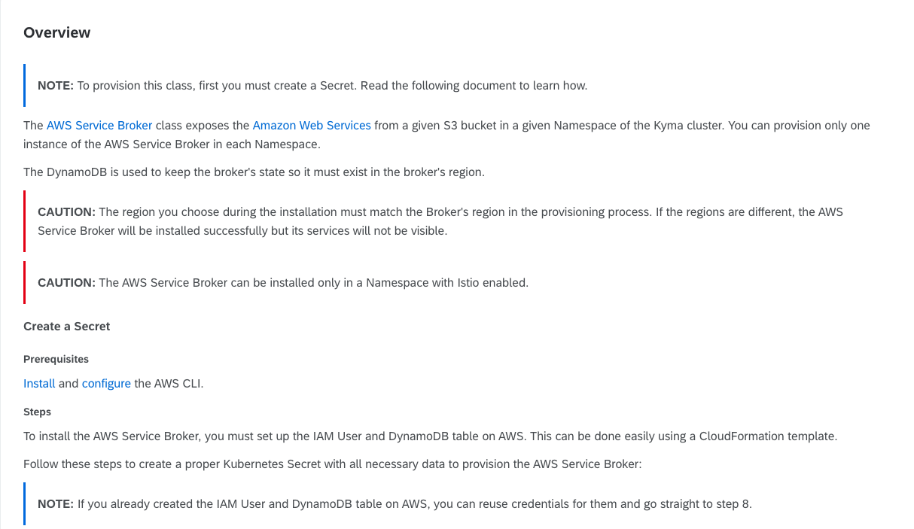
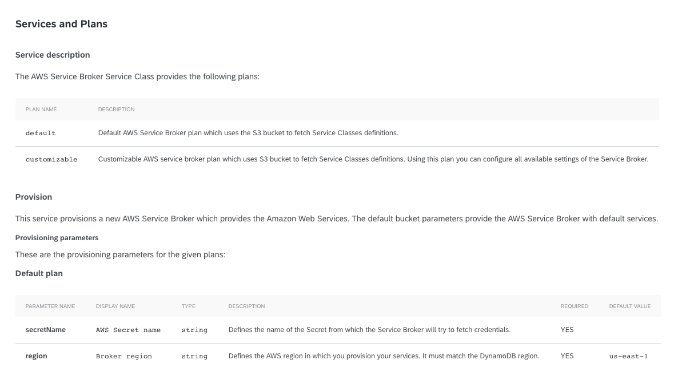
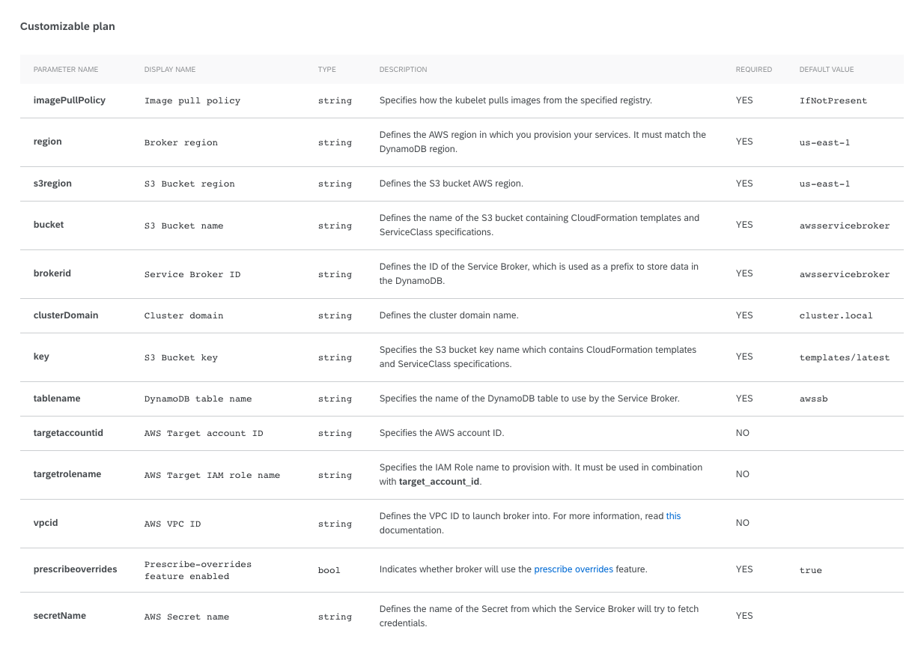

1.  Export the **REGION** variable:

    `export REGION=us-east-1 # The default region which works with default provisioning parameters`

    Set the **REGION** variable to the AWS region where you want to provision your services.

2.  Download the template:

    `wget https://raw.githubusercontent.com/awslabs/aws-servicebroker/v1.0.0/setup/prerequisites.yaml`

    You may need to align the prerequisites.yaml file if you use the **customizable** plan and change the bucket or DynamoDB parameters.

3.  Get the AWS stack:

    > **NOTE**: If you created the stack before in the same **REGION**, you can use its ID to create a Secret. In such a case, go straight to step 5. Find your stack ID in the [AWS Management Console](https://console.aws.amazon.com/) under the **Services** tab in the **CloudFormation** section.

    `export STACK_ID=$(aws cloudformation create-stack \ --capabilities CAPABILITY_IAM \ --template-body file://prerequisites.yaml \ --stack-name aws-service-broker-prerequisites \ --output text --query "StackId" \ --region $REGION)`

4.  Check if the stack is completed:

    `aws cloudformation describe-stacks \ --region $REGION \ --stack-name $STACK_ID \ --query "Stacks[0].StackStatus" \ --output text; \ echo $ST;`

    If the stack is completed, the output should equal CREATE_COMPLETE.

5.  Export **USERNAME** from the stack outputs:

    `export USERNAME=$(aws cloudformation describe-stacks \ --region $REGION \ --stack-name $STACK_ID \ --query "Stacks[0].Outputs[0].OutputValue" \ --output text)`

6.  Create the IAM user credentials and export them as the environment variables:

    `eval $(aws iam create-access-key \ --user-name $USERNAME \ --output json \ --query 'AccessKey.{KEY_ID:AccessKeyId,SECRET_ACCESS_KEY:SecretAccessKey}' | jq -r 'keys[] as $k | "export \($k)=\(.[$k])"')`

7.  Export the following variables:

        `export SECRET_NAME=aws-broker-data # The Secret name example, must be the same as the secretName provisioning parameter

    export SECRET_NAMESPACE= # The Namespace where you want to deploy AWS Service Broker`

8.  Use the **KEY_ID** and **SECRET_ACCESS_KEY** environment variables to create a Secret in the broker's Namespace:

    `kubectl create secret generic $SECRET_NAME -n $SECRET_NAMESPACE --from-literal=accesskeyid=$KEY_ID --from-literal=secretkey=$SECRET_ACCESS_KEY`

    For more information about the AWS Service Broker prerequisites, read [this](https://github.com/awslabs/aws-servicebroker/blob/v1.0.0/docs/install_prereqs.md) document.

