# Connecting local SAP Commerce to local Kyma

## Disclaimer

This guide is based on the [Working with Local Instances of SAP Commerce Cloud and Project "Kyma"](https://www.sap.com/cxworks/article/468901527/working_with_local_instances_of_sap_commerce_cloud_and_project_kyma) article written by SAP. We do not claim ownership of any of the content taken from it. For more information please visit the official documentation.

## Steps

1. While Kyma is running use the following command to determine the IP address of your Minikube cluster to connect it to your local SAP Commerce instance.

   ```bash
   minikube ssh -- ip route show
   ```

   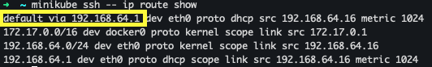

2. Add the IP address of the previous step to the `/path/to/commerce/hybris/config/local.properties` file in the format shown below. The IP address is typically `192.168.64.1` so there's no need to modify anything, if that's not the case simply replace it with the one you got.

   ```
   ccv2.services.api.url.0=https://local-192-168-64-1.nip.io:${tomcat.ssl.port}
   ```

   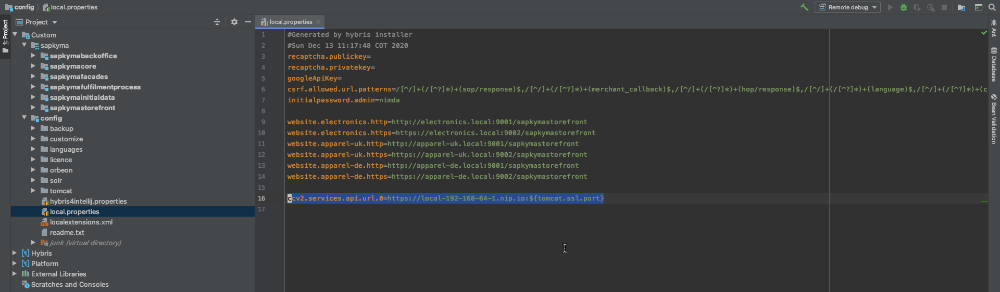

3. Make sure the `apiregistryservices.events.exporting` property is set to true, otherwise your local SAP Commerce instance won't export any events even if they are triggered. Paste this in the same file, `local.properties`.

   ```
   apiregistryservices.events.exporting=true
   ```

   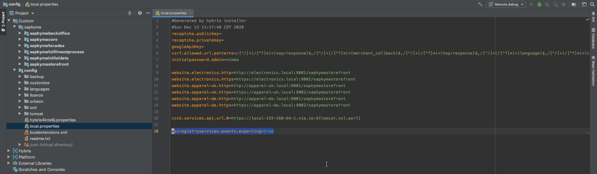

4. Import the Kyma server certificate into the default Java trust store by running these commands.

   ```bash
   curl -LO https://raw.githubusercontent.com/kyma-project/kyma/master/installation/certs/workspace/raw/server.crt
   ```

   > **NOTE:** You can change the _master_ word in the url with your Kyma version, but based on our findings the retrieved certificate is the same for master or any particular version.

   This will download the _server.crt_ to the path where the command was fired.

   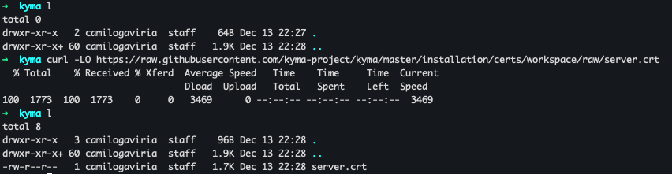

   ```bash
   "${JAVA_HOME}/bin/keytool" -keystore ${JAVA_HOME}/lib/security/cacerts -storepass changeit -import -file server.crt -alias kyma-local
   ```

   This one will put _server.crt_ certificate in the Java trust store.

   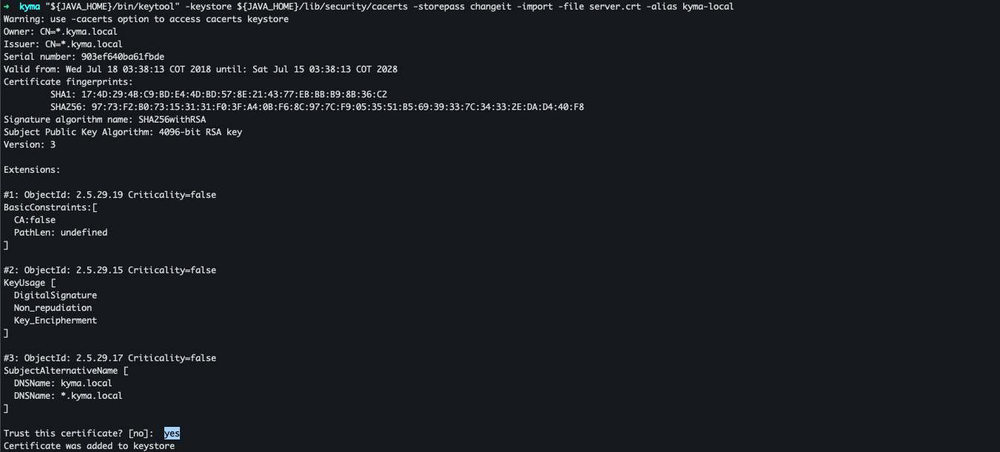

5. Patch the Application Registry to override Kyma defaults and disable TLS verification to ensure communication between Kyma and the SAP Commerce instance by running.

   ```bash
   kubectl -n kyma-integration patch deployment application-registry --type json -p='[{"op": "add", "path": "/spec/template/spec/containers/0/args/-", "value":"--insecureSpecDownload=true"}]'
   ```

   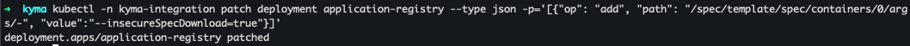

6. Create a new Kyma Application in the Kyma console. This application will connect to SAP Commerce later on. Follow the instructions as shown in the image to do so.

   6.1. While in the Kyma console go to the sidebar and select `Integration > Application/Systems`. Click `Create Application` in the top right hand corner.

   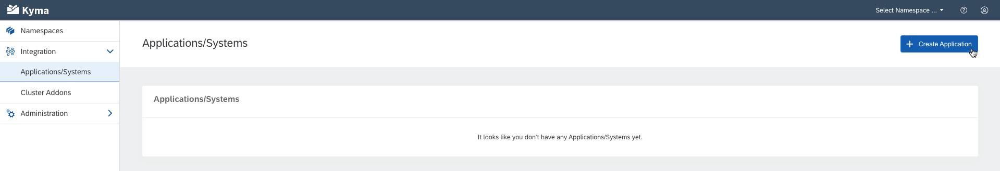

   6.2. Fill the required information as shown below.

   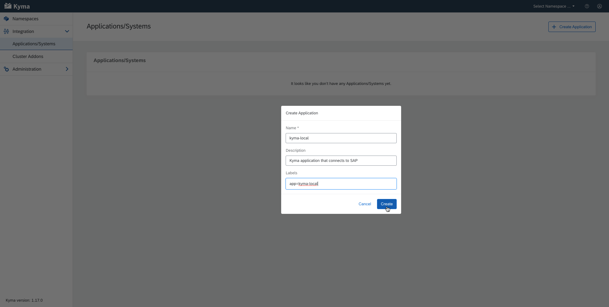

   6.3. Once that's done you will see the following.

   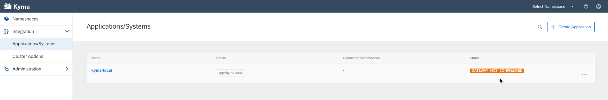

   6.4. Wait until the status changes to _Serving_.

   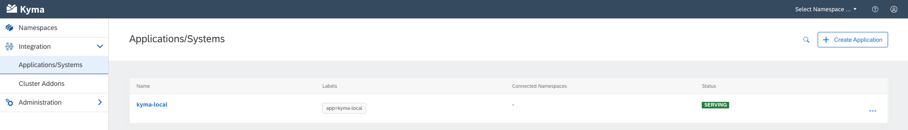

7. Patch the Application Gateway that is created after creating a Kyma application. Run the next command and **remember to replace _<APPLICATION_NAME>_ with the one in the previous step**.

   ```bash
   kubectl -n kyma-integration patch deployment <APPLICATION_NAME>-application-gateway --type json -p='[{"op": "add", "path": "/spec/template/spec/containers/0/args/-", "value":"--skipVerify=true"}]'
   ```

   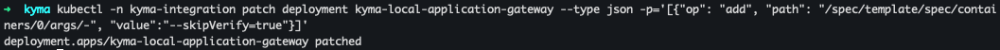

8. Now it's time to connect Kyma to SAP Commerce. Once this is done Kyma will have access to all the events and API services that SAP Commerce provided.

   8.1. Click on the application's name as seen in _6.4._. You will see the following UI. Select `Connect Application` in the top right hand corner of the screen.

   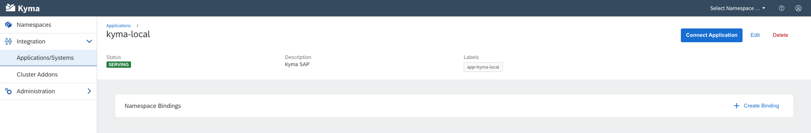

   8.2. Copy the URL.

   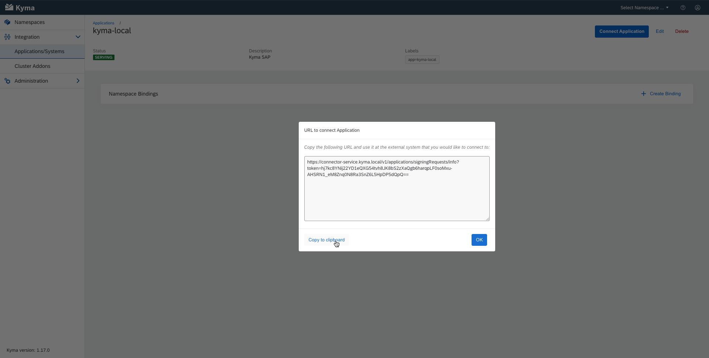

   8.3. Log in to SAP Commerce backoffice and search for API on the sidebar then click on `System > API > Destination Targets`.

   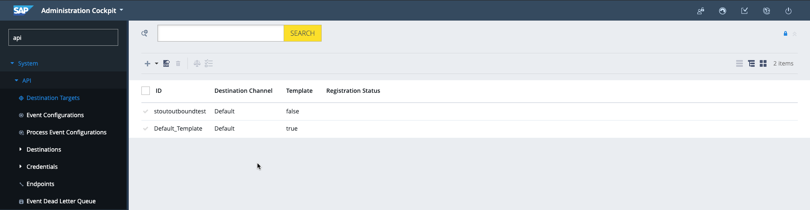

   8.4. Select _Default_Template_ and follow the steps as shown in the images.

   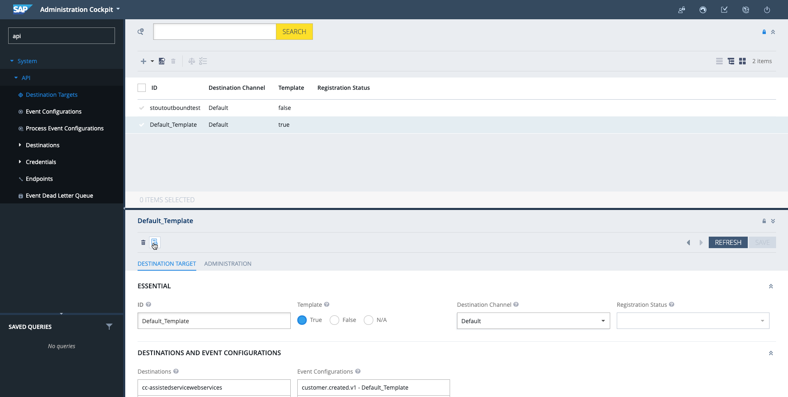

   8.5. Paste the URL you copied in step 8.2.

   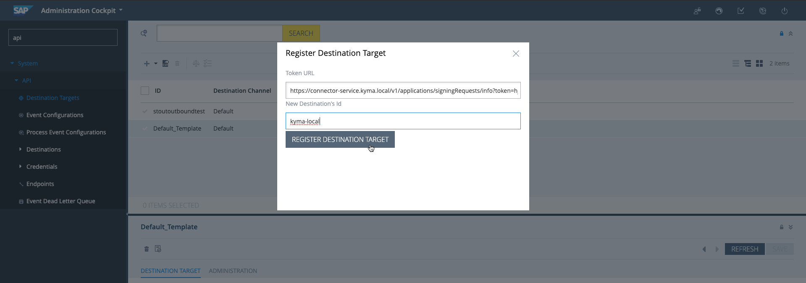

   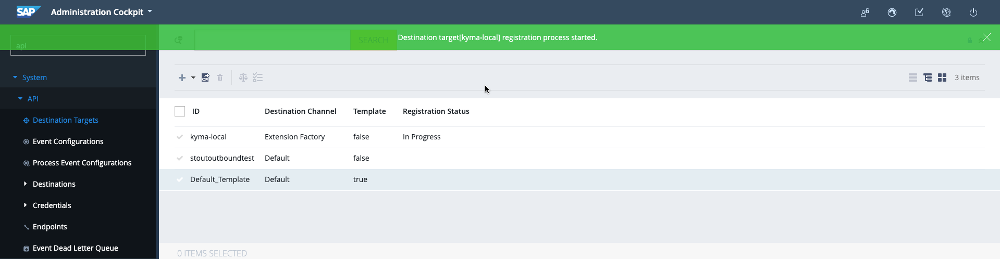

   8.6. Go back to your Kyma application and refresh the page. If you see all **9 Provided Services & Events** the pairing was successful.

   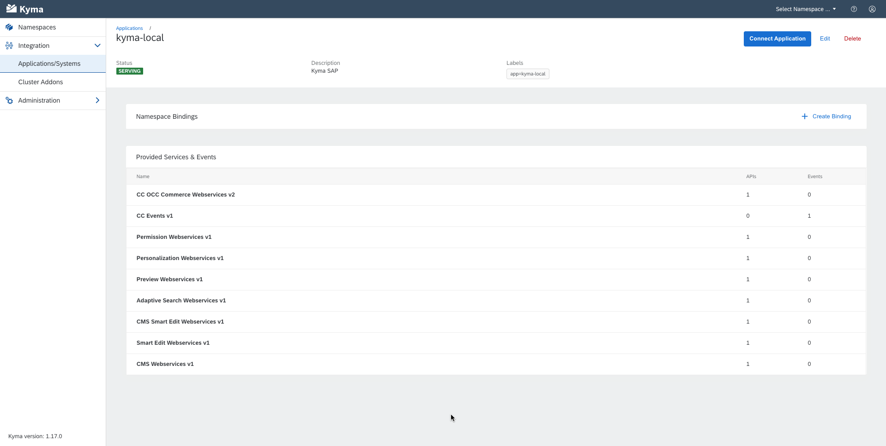

9. Now you need to bind a namespace to your application.

   9.1. Click on "Create Binding".

   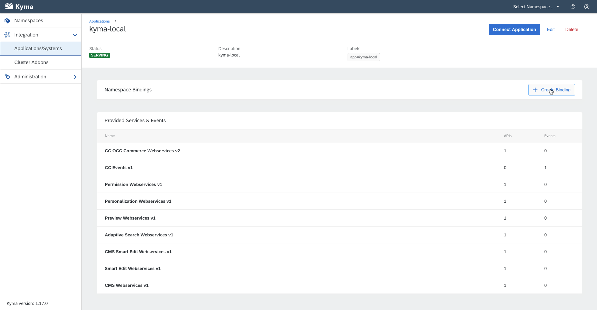

   9.2. Fill the fields.

   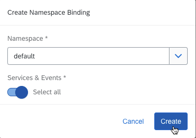

   > **NOTE:** You can use the default namespace or create a new one.

   Afther that in your namespace you should see one application bounded.

   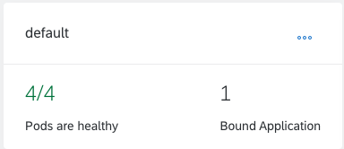

10. In the catalog of your namespace, you will see all the services offered by SAP, we need to create instances of the services that we want to provision to our functions or services. In this case we are going to use "CC Events v1" which helps you to trigger the SAP events and "CC OCC Commerce Webservices v2" which allows you to send http requests from Kyma to SAP.

    10.1. Click on the service.

    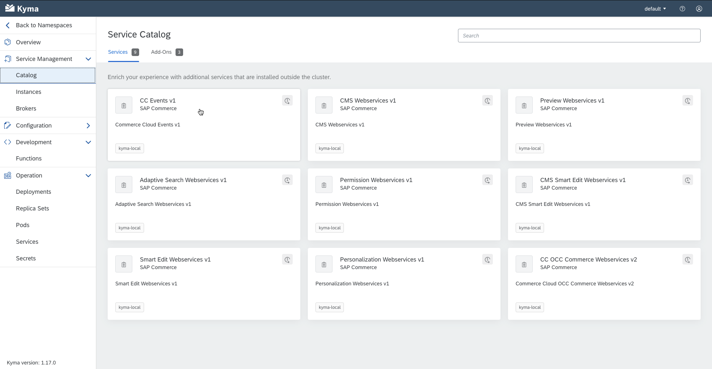

    10.2. Click on "Add once".

    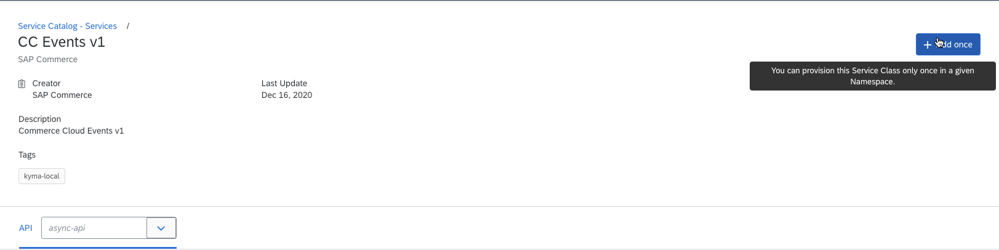

    10.3. Create with the default values.

    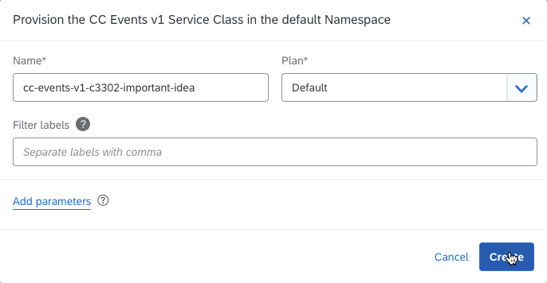

    Then your instances should look like this.

    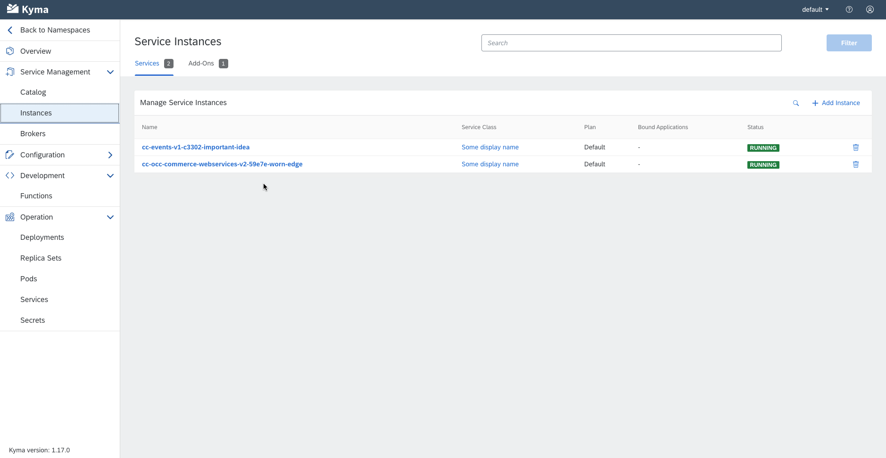

11. Create a new function.

    11.1. Click on "Create Function".

    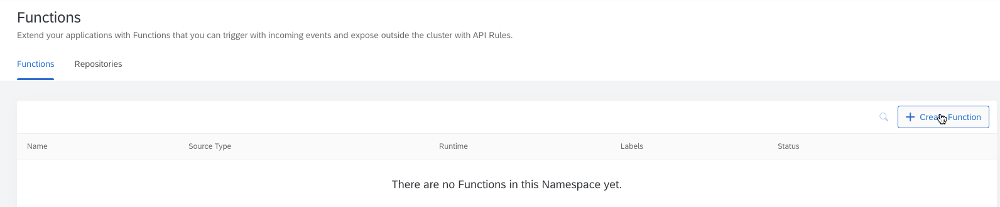

    11.2. Fill the fields.

    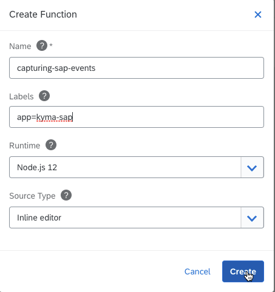

12. In the function you must add your source code and your dependencies. In this case after the function receives an event it sends a respose to [Webhook](https://webhook.site) with the data of the event.

    **Source:**

    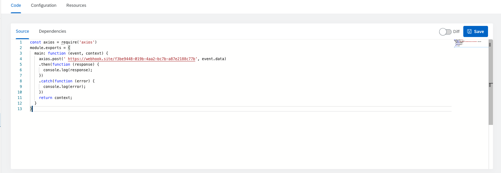

    **Dependencies:**

    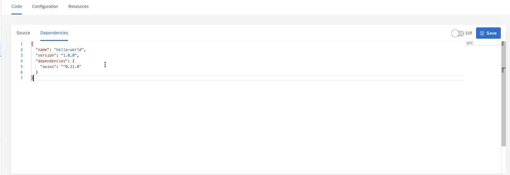

    > **NOTE:** Remember save the changes on your code and wait until the status change to "RUNNING"

    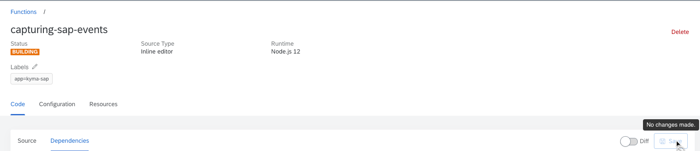

13. In the configuration tab you will see a section named "Event triggers" there you have to add a new event trigger and the function will be exectuted when that event happens, in this case we are going to select the customer created event.

    13.1. Click on "Trigger an event".

    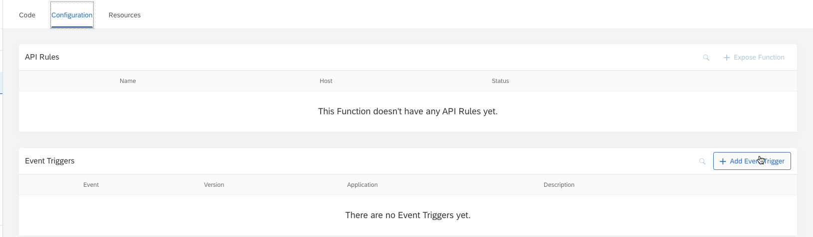

    13.2. Select the event and create it.

    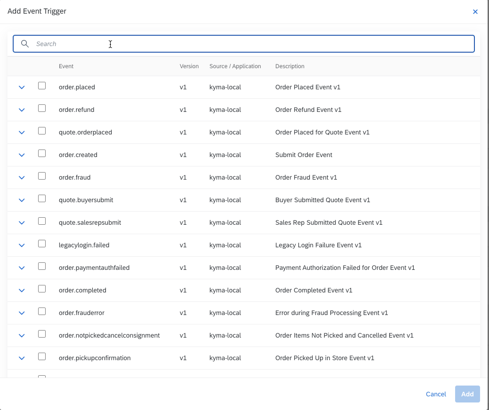

14. SAP and Kyma are connected, now it is time to test. Go to SAP and perform the action according to your trigger event, in this case we are going to create a new customer.

    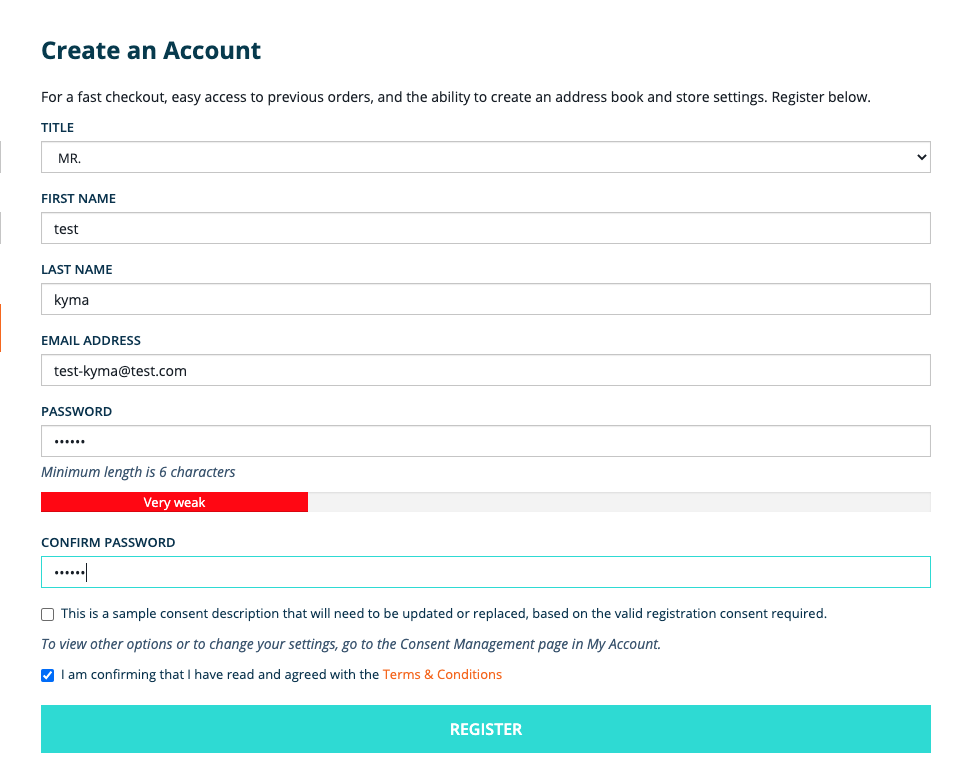

    > **NOTE:** In the hybris console you should see something like this.

    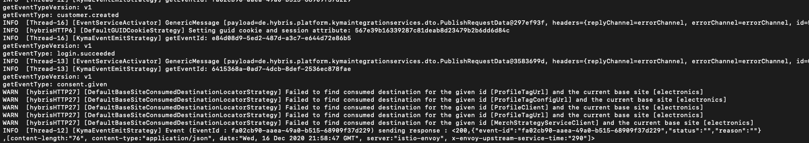

    Finally you can see the results on the url where you sent the response with the data of the event.

    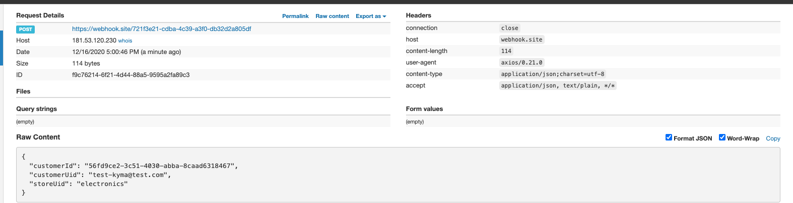
