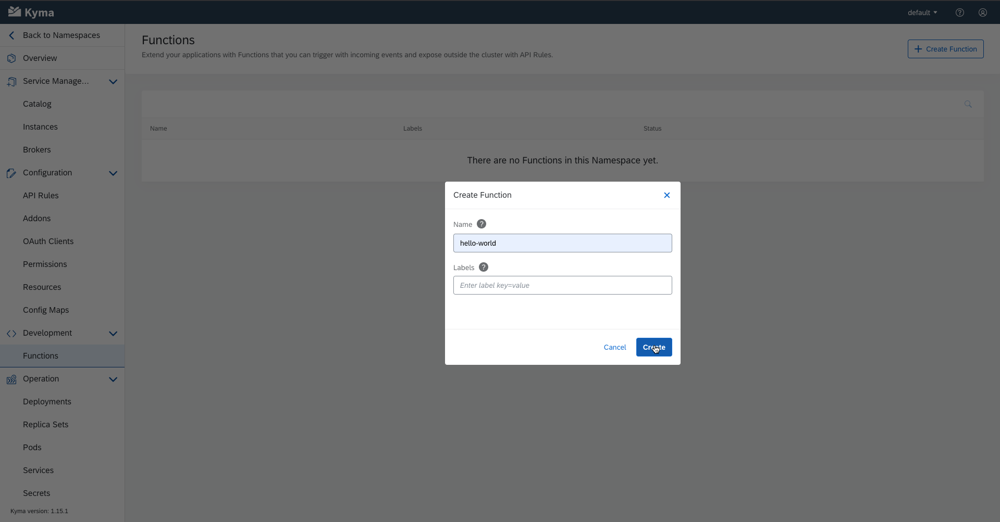

# Creating and Exposing Functions

## 1. Create Function

1. Go to the `Development > Function` entry in the sidebar. 

2. Click the `Create Function` button in the top right hand corner. 

3. You will be presented with a pop-up like this in which you enter the desired function name. 

4. This is where you code your function and list your dependencies (will be explain later on).  After you click `Save` it will start `Building` and `Deploying` until it reaches the `Running` state. 

5. Go to the sidebar and click on `Operation > Services` and you'll see a service with the same name as your function's.  Click the three dots at the end of the line and select `Expose API`. 

6. Here we create an `API Rule` by filling all available inputs as you see below. This establishes where the function is going to be listening on.  After you finish setting up you API Rule click `Create` and this should be the resulting status. 

7. Finally we issue the following commands on the terminal to try check if our function is working as intended. 

> NOTE: If you are using Minikube, you must run this command `echo "$(minikube ip) {service-url}.kyma.local" | sudo tee -a /etc/hosts` to add the endpoint to the Minikube IP entry in the `/etc/hosts` file before you can access the function.
